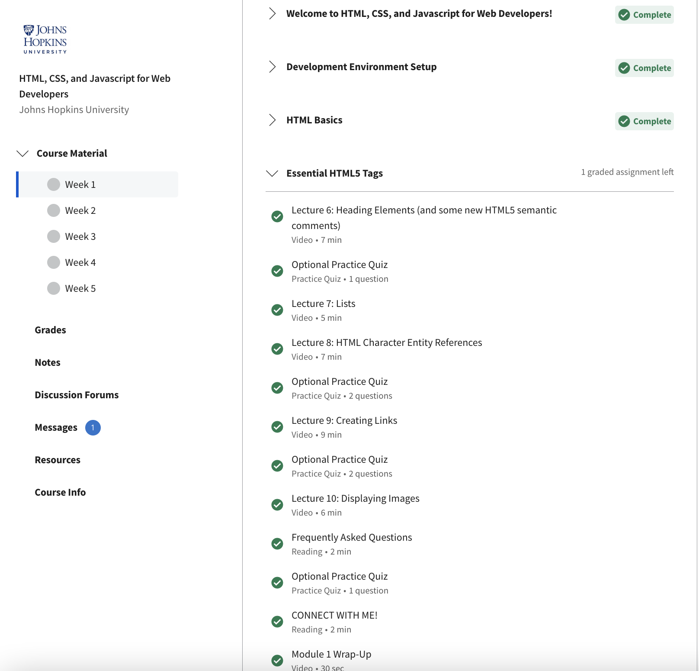
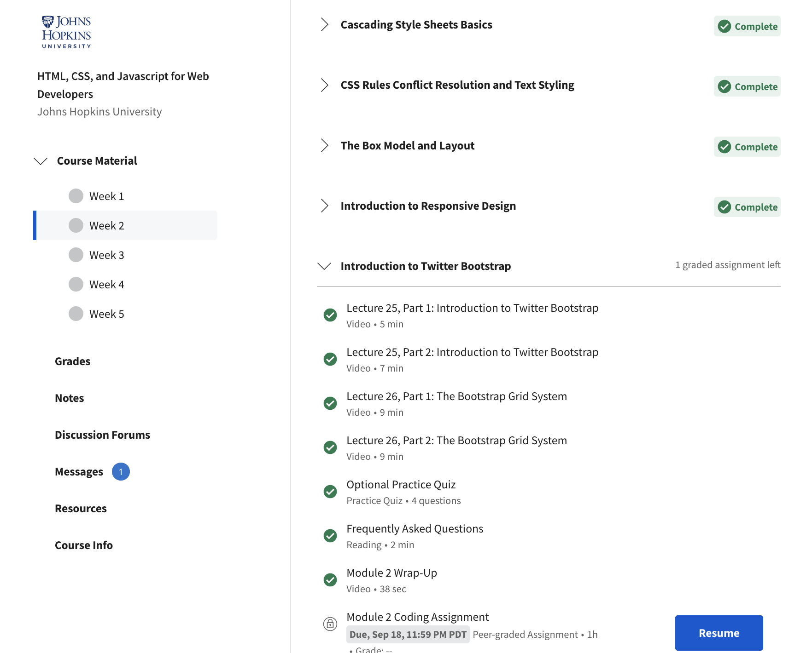
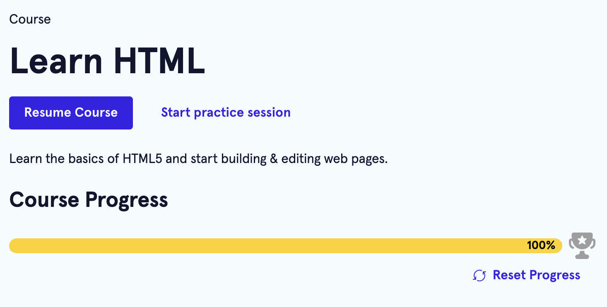
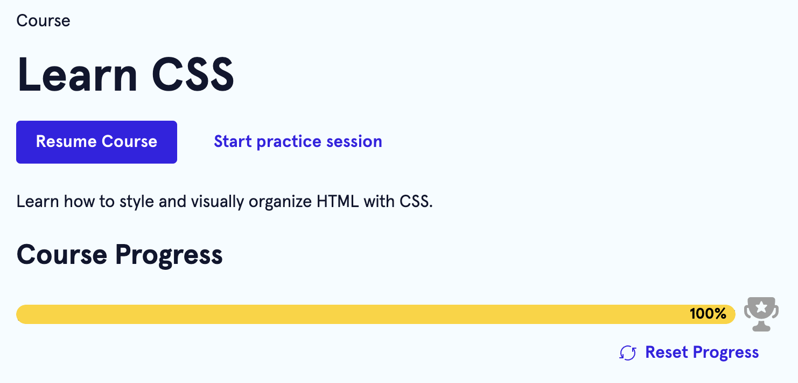

# kottans-frontend
## General

## 0. Git basics

The information about VCS was totally new for me. But i learned a lot of things and now i understand how GIT works.

## 1. Linux CLI, and HTTP

### Linux Survival
I have no experience with Linux system. But information was pretty clear and interesting. 

quiz 1

  

  

quiz 2

  

  

quiz 3

  

  

quiz 4

  

  

### HTTP articles 
The articles about HTTP are very informative and needs to be read thoughtfully and several times. I will return to them later for a more detailed understanding and this information will become more clear during my further work.

## Git Collaboration

More useful information and more understanding how to cooperate with the teams using Git and GitHub. I don't use PR on daily basis (yet:), so the information was new and interesting to me.

coursera week 3

  

  

coursera week 4

  

  

git branching basics

  

  

git branching repo

  

  

## Intro to HTML and CSS

I was already familiar with HTML and CSS, but it was a good idea to repeat my knowledge. The lessons were interesting and useful.

coursera week 1

  

  

coursera week 2

  

  

codecademy HTML

  

  

codecademy CSS

  

  

